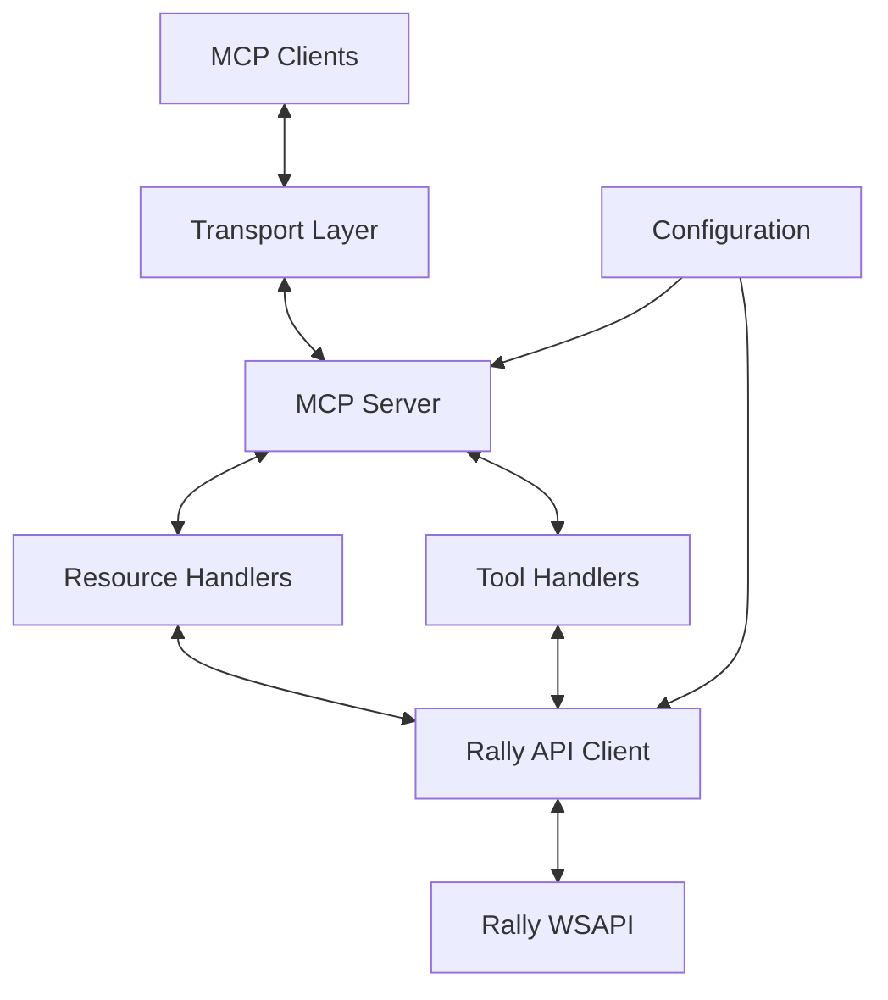
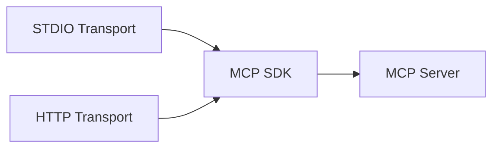
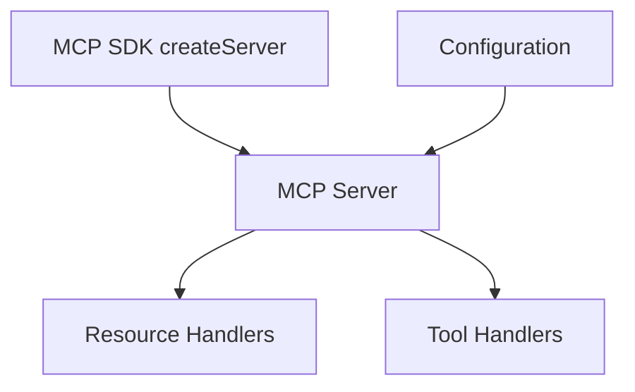
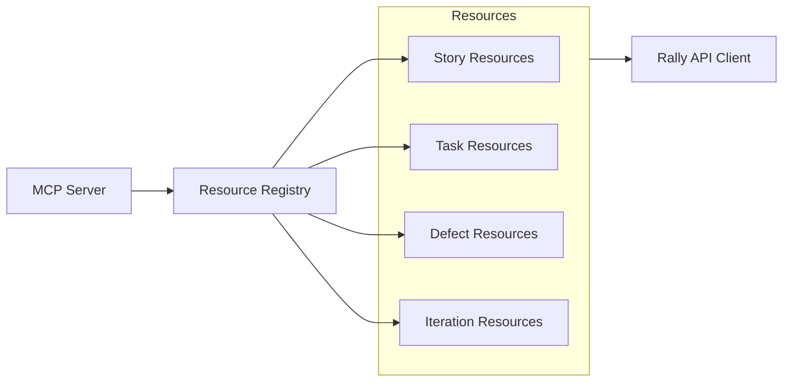
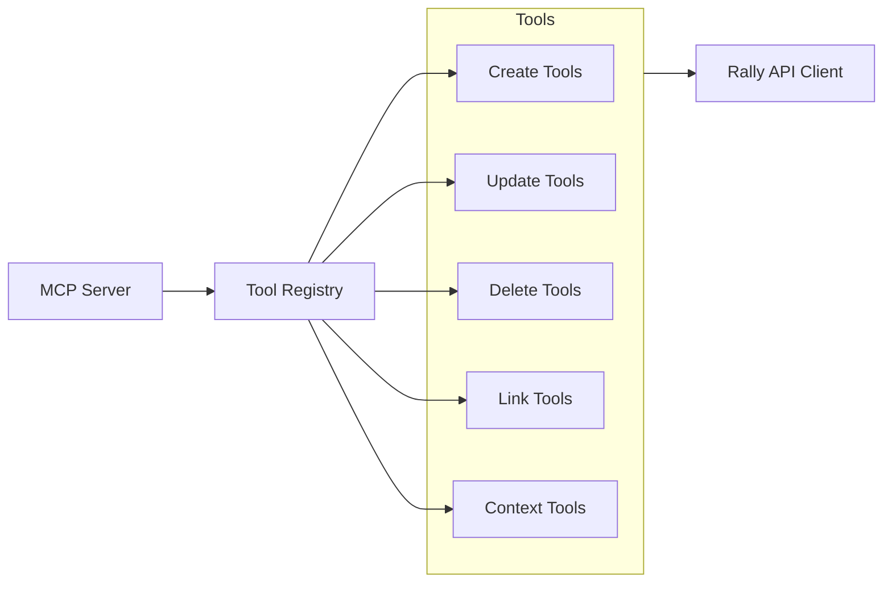
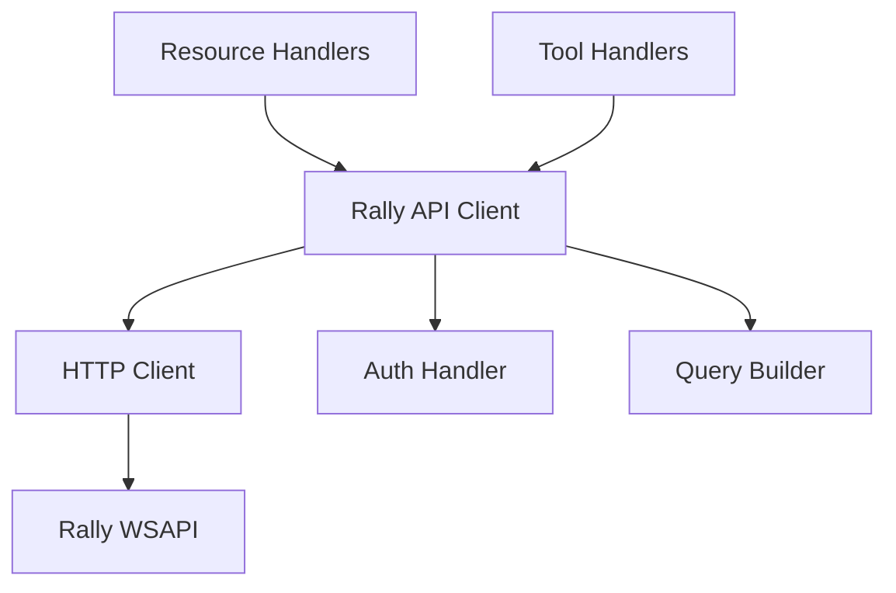
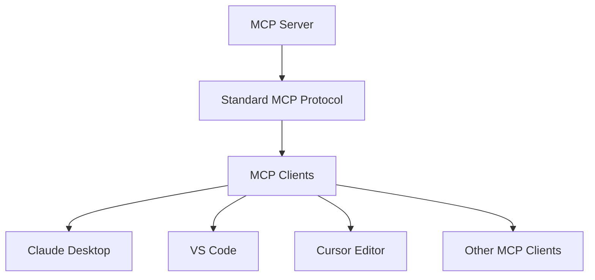
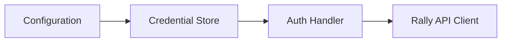
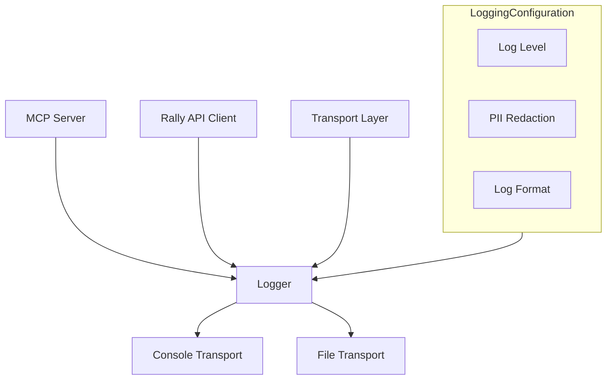
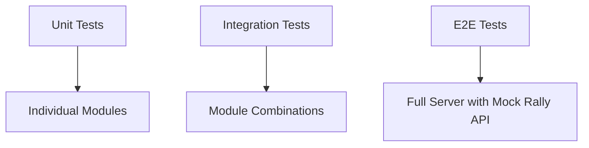

# mcp-rally-server Architecture Guide

This document outlines the architecture of the mcp-rally-server, a Model Context Protocol (MCP) server that exposes Rally data and operations. The server follows a modular, functional approach to ensure maintainability, testability, and extensibility.

## Table of Contents

1. [Architectural Overview](#architectural-overview)
2. [Component Breakdown](#component-breakdown)
3. [Data Flow](#data-flow)
4. [Module Structure](#module-structure)
5. [Error Handling Strategy](#error-handling-strategy)
6. [Authentication & Security](#authentication--security)
7. [Logging & Observability](#logging--observability)
8. [Testing Strategy](#testing-strategy)

## Architectural Overview

The mcp-rally-server is designed as a bridge between MCP clients and the Rally WSAPI. It follows a modular architecture with clear separation of concerns:



The server exposes two transport methods:

- STDIO for command-line usage
- HTTP for network-based communication

## Component Breakdown

### 1. Transport Layer

The server uses the built-in transport support from the MCP SDK:



Key responsibilities (handled by the SDK):

- Receive requests from clients via STDIO or HTTP
- Serialize/deserialize JSON-RPC messages
- Manage client connections and sessions (for HTTP)
- Forward requests to the MCP server

### 2. MCP Server Core

The server is created directly using the MCP SDK:



The server structure follows the standard MCP architecture:

```typescript
// Simple server creation with the SDK
import { createServer } from '@modelcontextprotocol/sdk/server';

const server = createServer({
  name: 'mcp-rally-server',
  version: '1.0.0',
});

// Register handlers
registerResources(server, rallyClient);
registerTools(server, rallyClient);

// Listen using built-in transport
await server.listen({ type: 'http', port: 3000, path: '/mcp' });
```

### 3. Resource Handlers

Resource handlers provide read-only access to Rally data:



Resources expose:

- Artifact listings with filtering and pagination
- Individual artifact details
- Related artifact queries

#### Query Parameter Handling

The resource handlers support query parameters using a multi-handler approach:

1. **Base Resource**: Handles the URI without query parameters

   ```typescript
   server.resource('stories', 'rally://stories', handleStories);
   ```

2. **Parameterized Resources**: Register specific URI patterns with common query parameters

   ```typescript
   server.resource('stories-with-params', 'rally://stories?pageSize=5', handleStories);
   ```

3. **Shared Logic**: Use helper functions to parse and handle any query parameters
   ```typescript
   // In both handlers, extract parameters from the URL
   const url = new URL(uri.toString());
   const queryParams = {};
   url.searchParams.forEach((value, key) => {
     queryParams[key] = value;
   });
   ```

This approach ensures that query parameters are properly passed to the Rally API client, enabling filtering, pagination, and sorting of results.

### 4. Tool Handlers

Tool handlers provide modifying operations for Rally data:



Tools provide:

- Create operations for artifacts
- Update operations for artifacts
- Delete operations for artifacts
- Ranking and linking operations
- Context management operations

### 5. Rally API Client

An abstraction layer over the Rally WSAPI:



Key responsibilities:

- Abstract Rally WSAPI details
- Handle authentication
- Construct proper WSAPI queries
- Transform Rally data to/from MCP format
- Manage pagination and query limits
- Implement retry logic

## Module Structure

The codebase is organized into a simple, flat structure:

```
src/
├── index.ts              # Entry point and server setup
├── config.ts             # Configuration management
├── rally/                # Rally API client
│   └── client.ts         # Rally client implementation
├── handlers/             # MCP handlers
│   ├── resources.ts      # Resource handlers
│   └── tools.ts          # Tool handlers
└── utils.ts              # Utility functions
```

This flat structure follows the patterns used in reference MCP server implementations, making the codebase easier to navigate and maintain.

### 1. Transport Layer

The server uses the built-in transport support from the MCP SDK:


Key responsibilities (handled by the SDK):

- Receive requests from clients via STDIO or HTTP
- Serialize/deserialize JSON-RPC messages
- Manage client connections and sessions (for HTTP)
- Forward requests to the MCP server

### 2. MCP Server Core

The server is created directly using the MCP SDK:


The server structure follows the standard MCP architecture:

```typescript
// Simple server creation with the SDK
import { createServer } from '@modelcontextprotocol/sdk/server';

const server = createServer({
  name: 'mcp-rally-server',
  version: '1.0.0',
});

// Register handlers
registerResources(server, rallyClient);
registerTools(server, rallyClient);

// Listen using built-in transport
await server.listen({ type: 'http', port: 3000, path: '/mcp' });
```

### 3. Client Compatibility

The server is designed to work with any MCP-compatible client, using the standard MCP protocol:



The server relies on the standard MCP protocol without custom client-specific adaptations, ensuring broad compatibility with any MCP-compliant client.

## Error Handling Strategy

Error handling follows a functional approach using a Result pattern:

```typescript
type Result<T, E = Error> = { success: true; value: T } | { success: false; error: E };
```

Key aspects of error handling:

1. **Categorized Errors**: Each error is typed based on its source and nature.

```typescript
// Example error types
type RallyApiError = {
  code: string;
  message: string;
  details?: unknown;
};

type ValidationError = {
  field: string;
  message: string;
};
```

2. **Error Mapping**: Rally API errors are mapped to appropriate MCP errors.

```typescript
// Example error mapping
function mapRallyErrorToMcpError(rallyError: RallyApiError): McpError {
  // Map Rally error codes to appropriate MCP error codes
  const errorCode = rallyErrorCodeMap[rallyError.code] || -32603; // Internal error default
  return {
    code: errorCode,
    message: `Rally API error: ${rallyError.message}`,
    data: rallyError.details,
  };
}
```

3. **Tool Error Handling**: Tool errors use the `isError` pattern specified by MCP:

```typescript
// Example tool error handling
try {
  const result = await createStory(params);
  return {
    content: [{ type: 'text', text: `Created story: ${result.FormattedID}` }],
  };
} catch (error) {
  return {
    isError: true,
    content: [{ type: 'text', text: `Error: ${error.message}` }],
  };
}
```

## Authentication & Security

The server handles authentication securely:



1. **Credential Sources**:

   - Environment variables (`RALLY_API_KEY`, `RALLY_USERNAME`, `RALLY_PASSWORD`)
   - Configuration file (with proper permissions)
     | Command line arguments (with warning about security)

2. **Credential Handling**:

   - Credentials are never logged
   - Credentials are not exposed in error messages
   - In-memory storage only
   - No persistence of credentials

3. **Authorization Flow**:
   - API Key is preferred
   - Username/password is supported as fallback
   - Authentication is performed on startup
   - Session tokens are refreshed as needed

## Logging & Observability

The server implements structured logging:



Key aspects:

1. **Log Levels**:

   - ERROR: Failed operations, critical issues
   - WARN: Potential issues, degraded functionality
   - INFO: Standard operational events
   - DEBUG: Detailed operation information
   - TRACE: Protocol-level message tracing

2. **Secure Logging**:

   - Automatic redaction of credentials
   - Request/response bodies are summarized, not fully logged
   - PII is redacted from logs

3. **Context Enrichment**:
   - Request IDs for traceability
   - Operation duration tracking
   - Connection source information

## Testing Strategy

The testing approach includes:

1. **Unit Testing**:

   - Individual modules tested in isolation
   - Mocked dependencies
   - Focus on pure functions

2. **Integration Testing**:

   - Testing module interactions
   - Mocked Rally API responses
   - Transport layer validation

3. **End-to-End Testing**:
   - Full server startup
   - Real MCP client interactions
   - Mocked Rally API (not real API calls)



---

This architecture guide serves as a blueprint for implementing the mcp-rally-server. It is designed to facilitate the creation of a robust, maintainable, and secure MCP server that effectively integrates with Rally's WSAPI while following the functional programming paradigm.
